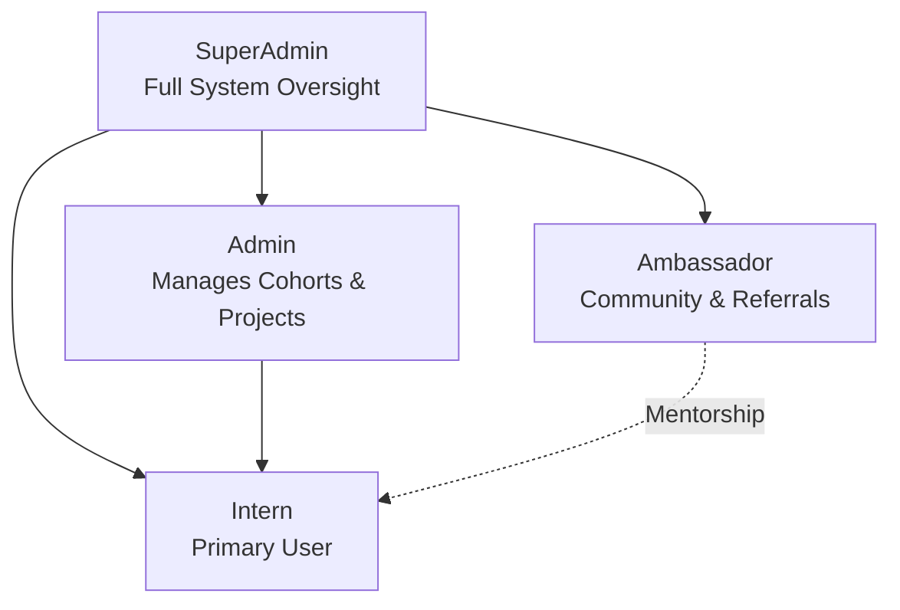

<div align="center">
  

  # RixiApp - Internship Management Platform
  
  **A comprehensive, scalable, and secure platform designed to streamline the entire internship lifecycle.**

  
  
  
  
  
</div>

<br />

RixiApp is an enterprise-grade Internship Management ecosystem built for Rixi Lab Technologies. It efficiently manages intern onboarding, project tracking, live proctored quizzes, and automated certificate generation across multiple administrative layers and user roles.

---

## Key Features

- **Multi-Role Authorization:** Hierarchical access control for SuperAdmins, Admins, Ambassadors, and Interns.
- **Interactive Dashboards:** Role-specific portals displaying real-time statistics, active tasks, submissions, and alerts.
- **Project Management:** Complete workflow spanning assignment distribution, intern submissions, and administrative reviews.
- **Live Proctored Quizzes:** Secure, time-bound testing environments equipped with cheating-prevention measures (e.g., blocking desktop browsers and enforcing full-screen constraints).
- **Automated Document Generation:** System-generated QR-coded completion certificates and personalized offer letters using PDFKit.
- **Intelligent Email Notifications:** Automated communications via Nodemailer for onboarding steps and completion milestones.
- **Cloud Asset Storage:** Integrated with Cloudinary for fast and secure media hosting.
- **Real-Time Status Tracking:** Heartbeat systems monitor user activity to provide responsive 'Online/Offline' presence.

---

## Technology Stack

| Architecture   | Technologies & Tools |
| -------------- | -------------------- |
| **Backend**    | Node.js, Express.js (v5) |
| **Database**   | MongoDB, Mongoose ODM |
| **Frontend**   | EJS Templating, Vanilla CSS, Bootstrap 5 |
| **Auth**       | Bcrypt, Express-Session |
| **File Sync**  | Multer, Cloudinary |
| **Services**   | PDFKit, QRCode, Nodemailer, Speakeasy, Cashfree SDK |

---

## User Roles & Capabilities



| Role | Details & System Permissions |
| :--- | :--- |
| **SuperAdmin** | Full system oversight and architecture control. Capable of managing all Admins, Ambassadors, and Interns globally, triggering systemic migrations, and broadcasting system notices. |
| **Admin** | Manages assigned localized Intern cohorts. Controls the lifecycle of projects, handles virtual meetings, and verifies test grade integrity. |
| **Ambassador** | Authorized partners capable of managing their localized communities and tracking insights regarding referred candidates. |
| **Intern** | The primary audience. Interacts with dashboards to log attendance, take verified quizzes, submit deliverables, communicate with admins, and download final credentials. |

---

## Getting Started

Follow these instructions to set up and deploy the project locally for development.

### 1. Prerequisites

Ensure you have the following ready on your core machine:
- **Node.js** (v16.x or newer strongly recommended)
- **MongoDB** (Local instance installed or cloud-based MongoDB Atlas Cluster)
- **Cloudinary Account** (for file uploads)

### 2. Installation & Setup

Clone the repository and install dependencies:

```bash
git clone https://github.com/anunayanand/RixiApp.git
cd RixiApp
npm install
```

### 3. Environment & Configuration

Create a `.env` file at the root level of your directory and configure your credentials.

> **Warning:** Do not commit your `.env` file to version control.

```env
# Database Credentials
MONGO_URI=your_db_uri

# API Core Protocols
SESSION_SECRET=your_super_secret_session_key
PORT=8080

# Cloudinary Integration
CLOUD_NAME=your_cloudinary_cloud_name
CLOUD_API_KEY=your_cloudinary_api_key
CLOUD_API_SECRET=your_cloudinary_api_secret

# Automatic Mailing Operations
EMAIL_HOST=smtp.your_email_host.com
EMAIL_PORT=465
EMAIL_USER=your_secure_email@domain.com
EMAIL_PASS=your_app_specific_password
```

### 4. Booting the Server

Run the development instance locally, powered by nodemon for hot-reloads:

```bash
npm start
```
Once running, access the application at: `http://localhost:8080`

---

## Detailed Folder Architecture

```text
RixiApp
├── .git                 # Core version control system
├── middleware/          # Express middlewares for security and validation
│   ├── appMiddleware.js # Core rate-limiters and global middlewares
│   └── ...
├── models/              # MongoDB Mongoose schemas
│   ├── Admin.js, Ambassador.js, User.js, SuperAdmin.js
│   └── Project.js, Quiz.js, ChatTicket.js...
├── public/              # Static assets exposed to the client
│   ├── css/             # Stylesheets for various dashboard views
│   ├── fonts/           # Local typography assets
│   ├── img/             # Raw image assets (logos, icons)
│   └── js/              # Client-side dynamic scripts (admin.js, intern.js)
├── routes/              # Highly modularized backend network paths
│   ├── admin/           # Routes exclusive to Admin portal
│   ├── auth/            # Authentication and registration flows
│   ├── common/          # Shared routes (e.g., heartbeat, general API)
│   ├── intern/          # Routes exclusive to Intern portal
│   └── superAdmin/      # Routes exclusive to SuperAdmin portal
├── services/            # Background tasks and third-party integrations
│   └── backgroundTasks.js # Automated cleanup and backup jobs
├── utilities/           # Helper functions and utilities
│   └── downloadData.js  # Scripts for exporting system data
├── views/               # EJS Frontend Templates
│   ├── partials/        # Reusable UI components (headers, footers)
│   ├── admin/           # Admin-specific templates
│   ├── intern/          # Intern-specific templates
│   └── superAdmin/      # SuperAdmin-specific templates
├── app.js               # Main application entrypoint
├── db.js                # Database connection handler
├── package.json         # Project dependencies and scripts
└── README.md            # Documentation
```

---

## Security Posture

We prioritize application integrity and confidentiality:
1. **Hardened Credentials:** Enforced password encryption via `bcrypt`.
2. **Secure Sessions:** Encrypted and HTTP-only cookies managed through `express-session` and `connect-mongo`.
3. **Advanced Rate-Limiting:** `express-rate-limit` mitigates brute-force attacks and spam targeting core endpoints.
4. **Environment Isolation:** Zero reliance on hardcoded secrets, depending entirely on isolated `.env` constructs.

---

## Legal & Licensing

This software framework is proprietary architecture forged exclusively for Rixi Lab Technologies. Unauthorized replication, cloning, or distribution is severely restricted.

<p align="center">
  <i>Designed by the Rixi Lab Technologies Team</i>
</p>
